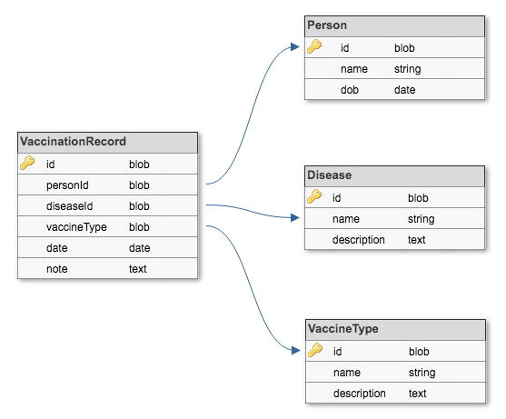

# Immunization Register

## A full CRUD MEHN (Mongo, Express, Handlebars, Node) WebApp

MongoDB CRUD Operations:
<ul>
<li>Create</li>
<li>Read</li>
<li>Update</li>
<li>Delete</li>
</ul>

#### MongoDB Schema:

Types of Vaccines:
<ul>
<li>Live, attenuated</li>
<li>Inactivated/Killed</li>
<li>Toxoid (inactivated toxin)</li>
<li>DSubunit/conjugate</li>
</ul>

