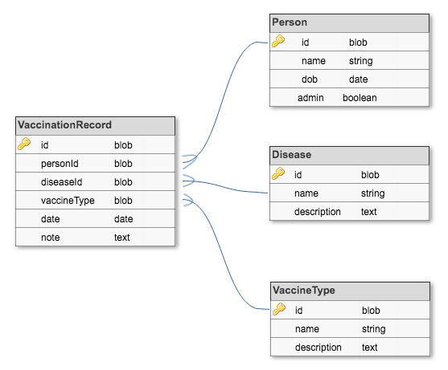
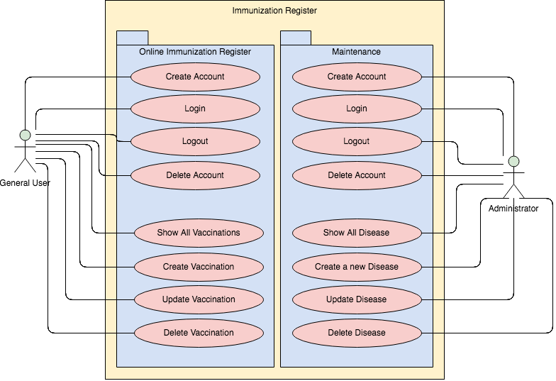

# Immunization Register

## A full CRUD MEHN (Mongo, Express, Handlebars, Node) WebApp

MongoDB CRUD Operations:
<ul>
<li>Create</li>
<li>Read</li>
<li>Update</li>
<li>Delete</li>
</ul>

#### MongoDB Schema:

Types of Vaccines:
<ul>
<li>Live, attenuated</li>
<li>Inactivated/Killed</li>
<li>Toxoid (inactivated toxin)</li>
<li>DSubunit/conjugate</li>
</ul>

#### User Cases:

### Technologies used in this application:
<ul>
<li>JavaScript</li>
<li>Node.js</li>
<li>Express.js</li>
<li>DMongoose</li>
<li>HTML5 with CSS</li>
</ul>

## Links related with this project:

<a href="https://github.com/Silvia42/ImmunizationRegister/projects/1">Project Board</a>
 
<a href="https://pacific-dawn-76771.herokuapp.com/imre/">Immunization register on Heroku</a>

https://giphy.com/stickers/syringe-17tKkkKF8rzCU

## Project Resources:
<ul>
<li><a href="https://www.cdc.gov/vaccines/index.html">CDC - Vaccines & Immunizations</a></li>
<li><a href="https://www.humanservices.gov.au/individuals/services/medicare/australian-immunisation-register">Australian Immunisation Register</a></li>
<li><a href="https://giphy.com/stickers/syringe-17tKkkKF8rzCU">Syringe animated gif</a></li>

</ul>

